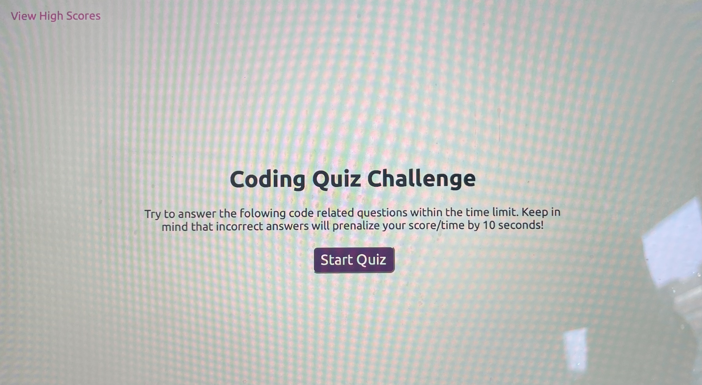
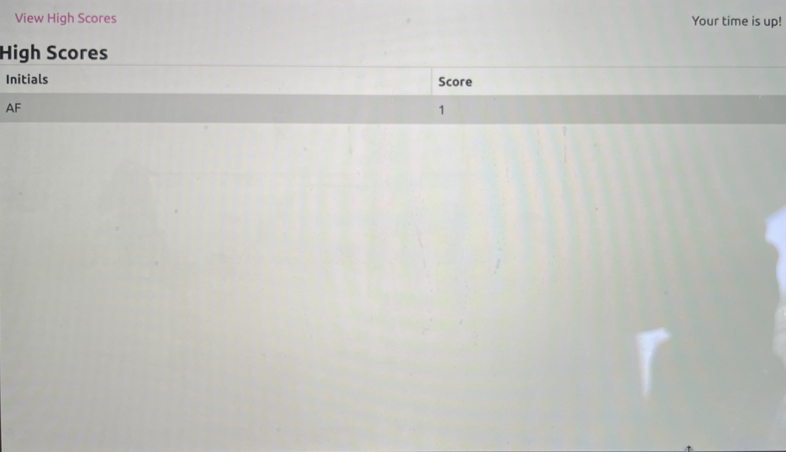

# JavaScript Timed Quiz

Author: Alexia Fast

## Description

The assignment was to create a timed quiz using JavaScript that incorporated your total score. I accomplished this by first declaring my variables, and then writing various functions, objects and loops. This project seemed confusing at first, but as I continued to work through it, the concepts and syntax of JavaScript became clear. I styled various elements using "getElementById" and added "eventListner" to the buttons. I was able to check if the users answers to the quiz questions were correct or false, and then alert the user of their result. I succesfully created a timer that took of 10 seconds everytime the user got a question wrong. I was also able to capture the users score and record it on the page. 

### View screen-shot below

### View deployed website below

https://purealexiafast.github.io/timed-quiz-javascript/

Our licensing is MIT. This ensures that users can re-use the code if desired. They can also make thier own changes or modifications.